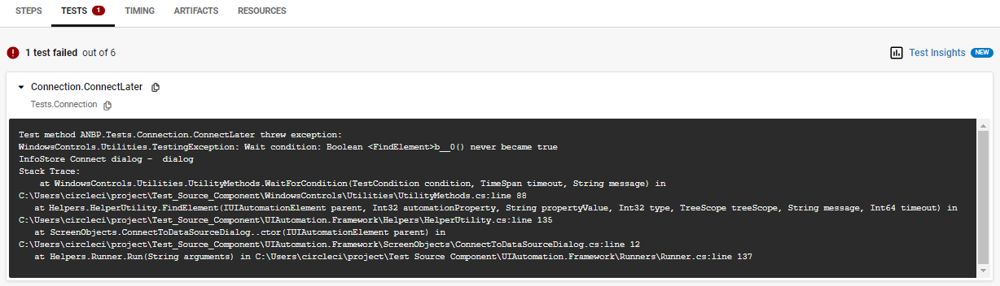
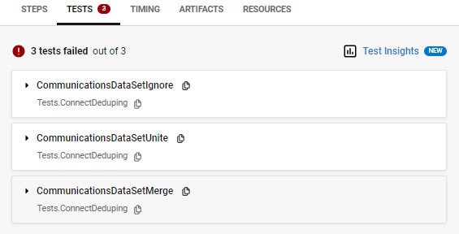
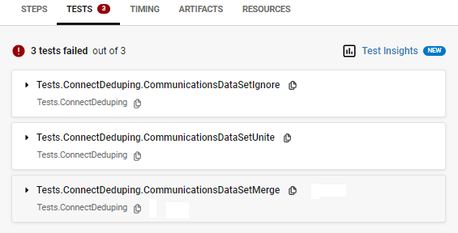

# CircleCI Recommendation

## Summary

```yml
- run:
   name: Run Tests
   command: |
     dotnet test ... --logger:"junit;LogFilePath=TestResults/test-result.xml;FailureBodyFormat=Verbose;MethodFormat=Class"
- store_test_results:
   path: TestResults/
- store_artifacts:
   path: TestResults/
```

See also: [this sample repository][circleci-windows-project-example].

## Details

CircleCI uses just a few pieces of the JUnit XML report to generate the displayed user interface.
A basic example `junit.xml` file which can be parsed by CircleCI can be seen
[here][circleci-junit-xml-report].

For each failed test (i.e. for each JUnit `<testcase>` element containing a failure or an error),
CircleCI only shows the testcase's failure/error message,
any text within the failure/error element,
plus any `<system-out>` or `<system-err>` text.
It does not show the testcase's properties.
It does not show data from the testsuite.

By default, the logger records test console output in the JUnit testsuite,
which CircleCI ignores;
this can be improved upon by setting `FailureBodyFormat` when invoking the logger.
Setting MethodFormat provides no additional information or functionality.

### FailureBodyFormat

Setting `FailureBodyFormat=Verbose` when invoking the logger ensures that
any test console output is visible in the CircleCI UI for (failed) tests.
This can provide important/useful information,
especially if the test failure message is insufficiently informative on its own.

- `Default`:

  

- `Verbose`:

  

### MethodFormat

CircleCI shows the class names of each failed test so setting
`MethodFormat=Class` or `MethodFormat=Full`
provides no further information on the CircleCI UI;
the effect is purely cosmetic and is a matter of personal preference.

- `Default`:

  

- `Class` and `Full`:

  

### Store Test Results

To enable CircleCI to show test results on the job's page,
to interpret generated test result files to be used for gathering
[Test Insights][circleci-test-insights]
and
[Test Splitting][circleci-test-splitting],
the files must be stored using the
[`store_test_results` step][circleci-store-test-results-step].

```yml
- store_test_results:
   path: TestResults/
```

### Store Artifacts

To enable further troubleshooting,
the test results file should _also_ be stored as an artifact using the
[`store_artifacts` step][circleci-store-artifacts-step].
This allows the user to view and download the contents of the raw `*.xml` file,
which is useful where the user requires information from the file that CircleCI does not display.

```yml
- store_artifacts:
   path: TestResults/
```

### Test Splitting

CircleCI can enable a suite a tests to be split across multiple executors in parallel by using (timing) data logged by this junit logger.

The simplified summary (above) does not include this functionality but this is recommended for non-trivial test workloads,
especially where the test execution time significantly exceeds the time taken to set up ready for the first test.
This technique reduces the total (elapsed-time) duration of the tests and thus provides a faster test feedback loop.

For an example of a CircleCI Windows project that demonstrates parallel test execution, take a look at
[this sample repository][circleci-windows-project-example].

-----

## Footnote

As of July 20 2023:

- Only the data in a `<testcase>` element is interpreted by CircleCI.
  - e.g. `<system-out>` from within a `<testcase>` is shown.
- Data outside of a `<testcase>` element is not interpreted by CircleCI.
- The `<properties>` from a `<testcase>` aren't interpreted by CircleCI.
- By default, the logger only puts console text (`<system-out>` and `<system-err>`) in elements at the `<testsuite>` level (not into `<testcase>`) so CircleCI  does not interpret it.

e.g.

```xml
<testsuites>
  <testsuite>
    <testcase name="Displayed in bold on the CircleCI WebUI" classname="Also shown" time="Used for test splitting">
      <properties>
        <property name="CircleCI" value="Does not show these" />
      </properties>
      <failure message="This can be seen in CircleCI">So can this</failure>
      <system-out>This is also shown by CircleCI<system-out>
      <system-err>Same for system-err too</system-err>
    </testcase>
    <system-out>CircleCI ignores data here</system-out>
    <system-err>Same for system-err too</system-err>
  </testsuite>
</testsuites>
```

[circleci-junit-xml-report]: https://circleci.com/docs/use-the-circleci-cli-to-split-tests/#junit-xml-reports
[circleci-test-insights]: https://circleci.com/docs/insights-tests/
[circleci-test-splitting]: https://circleci.com/docs/use-the-circleci-cli-to-split-tests/#split-by-timing-data
[circleci-store-test-results-step]: https://circleci.com/docs/configuration-reference/#storetestresults
[circleci-store-artifacts-step]: https://circleci.com/docs/configuration-reference/#storeartifacts
[circleci-windows-project-example]: https://github.com/jenny-miggin/circleci-demo-windows-test-splitting
